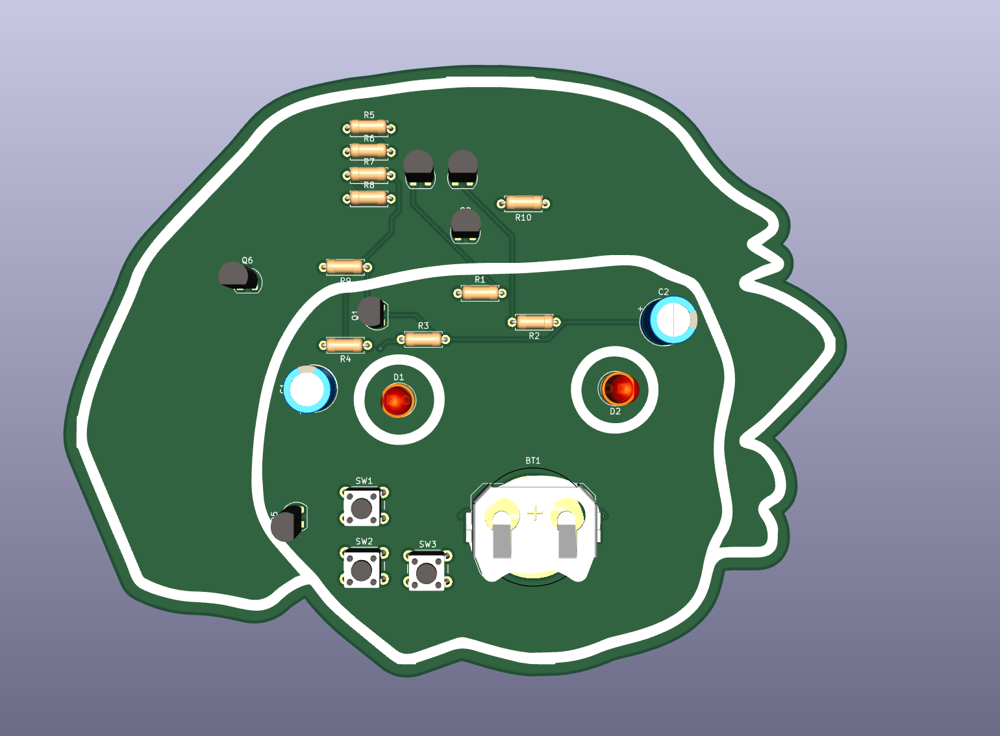
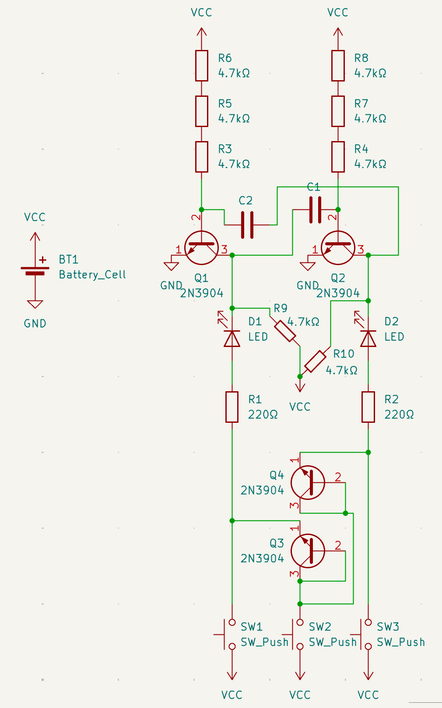
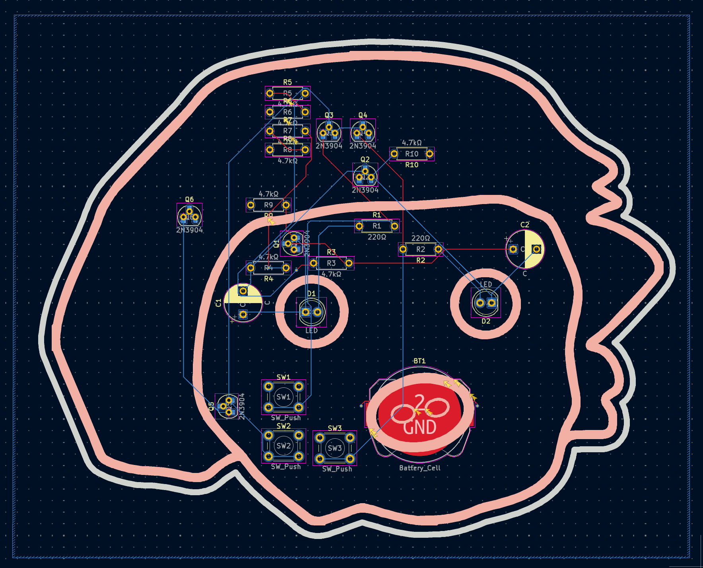

# solder-pcb
My PCB Submission for https://solder.hackclub.com

## Screenshots

## Function
- Press the left button to make the left LED blink.
- Press the middle button to make both LEDs blink.
- Press the right button to make the right LED blink.

## BOM

| Part           | Ct. |
|----------------|-----|
| 10uF Capacitor |  2  |
| 4.7kΩ Resistor |  8  |
| 220Ω Resistor  |  2  |
| LED            |  2  |
| Push button    |  3  |
| 2N3904 NPN Tr. |  6  |
| Battery Holder |  1  |

## Slack Username
jojocoding
